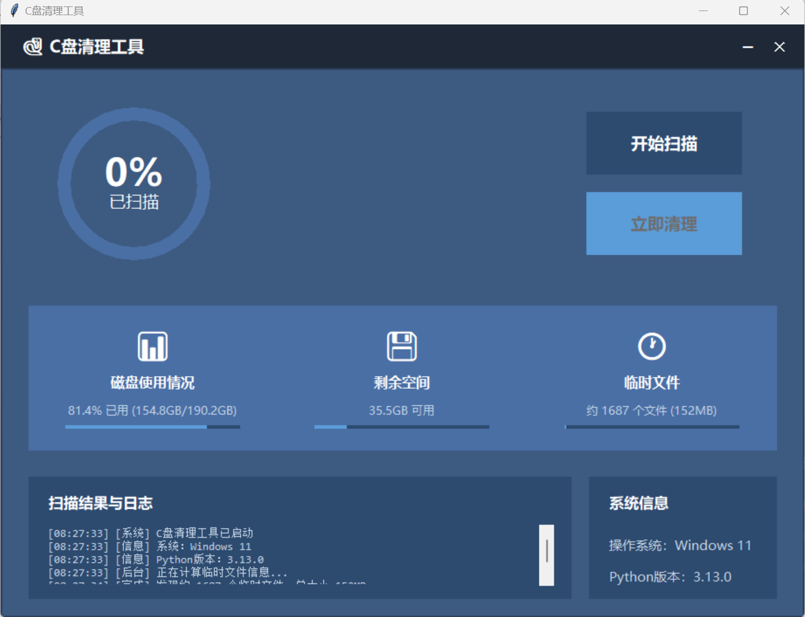

# 🐍 C盘清理工具 (C Drive Cleaner)

<div align="center">


一个简洁高效的 Windows C盘清理工具，帮助你快速释放磁盘空间

[功能特性](#-功能特性) • [快速开始](#-快速开始) • [使用说明](#-使用说明) • [截图预览](#-截图预览) • [常见问题](#-常见问题)

</div>

---

## 📌 项目简介

C盘清理工具是一个基于 Python + Tkinter 开发的 Windows 系统清理工具，能够智能扫描并清理系统临时文件、浏览器缓存、Windows 更新残留等垃圾文件，帮助你快速释放 C 盘空间。

### 🎯 为什么选择这个工具？

- **智能识别**：自动定位 15+ 种常见垃圾文件源
- **安全可靠**：只清理临时文件，不会误删重要数据
- **界面友好**：现代化 UI 设计，操作简单直观
- **完全免费**：开源免费，无广告无捆绑
- **轻量快速**：纯 Python 实现，无需安装复杂依赖

---

## ✨ 功能特性

### 核心功能

- ✅ **智能扫描**：快速扫描 C 盘垃圾文件，实时显示进度
- 🗑️ **一键清理**：支持清理系统临时文件、浏览器缓存等
- 📊 **可视化展示**：圆形进度条、统计卡片、实时日志
- 💾 **磁盘监控**：实时显示磁盘使用情况
- 🚀 **后台计算**：自动统计临时文件大小和数量

### 支持清理的文件类型

| 类别 | 说明 | 典型大小 |
|------|------|----------|
| 🔄 Windows Update 缓存 | `SoftwareDistribution\Download` | 5-15GB |
| 🗂️ 系统升级残留 | `Windows.old` | 20-40GB |
| 🐛 系统错误转储 | `Minidump`、`Memory.dmp` | 1-8GB |
| 📝 系统日志 | `Windows\Logs`、`Panther` | 500MB-2GB |
| 🌐 浏览器缓存 | Chrome、Edge、Firefox 缓存 | 5-20GB |
| 🗑️ 回收站 | 所有盘符的回收站文件 | 不定 |
| 📦 临时文件 | `%TEMP%`、`Windows\Temp` | 2-5GB |

---

## 🚀 快速开始

### 环境要求

- **操作系统**：Windows 7/8/10/11
- **Python 版本**：Python 3.7 或更高版本
- **权限要求**：建议以管理员身份运行（可额外清理 8GB+）

### 安装步骤

1. **克隆仓库**
```bash
git clone https://github.com/lihuifengyyds/cdrive-cleaner.git
cd cdrive-cleaner
```

2. **检查 Python 环境**
```bash
python --version
# 确保输出 Python 3.7+
```

3. **运行程序**
```bash
python cdrive_cleaner.py
```

### 以管理员身份运行（推荐）

**方法一：右键菜单**
```
右键 main.py → 以管理员身份运行
```

**方法二：命令行**
```bash
# 以管理员身份打开 PowerShell 或 CMD
cd 项目目录
python cdrive_cleaner.py
```

---

## 📖 使用说明

### 基本操作流程

1. **启动程序**
   - 运行 `cdrive_cleaner.py`
   - 程序会自动显示当前磁盘使用情况

2. **开始扫描**
   - 点击「开始扫描」按钮
   - 等待扫描完成（通常需要 1-3 分钟）
   - 查看日志区域的扫描结果

3. **立即清理**
   - 扫描完成后，「立即清理」按钮会激活
   - 点击按钮并确认清理
   - 程序会自动清理垃圾文件并清空回收站

4. **查看结果**
   - 清理完成后会显示释放的空间大小
   - 磁盘使用情况自动更新

### 界面说明

```
┌────────────────────────────────────────────────┐
│  🐍 C盘清理工具                    ─  ✕        │
├────────────────────────────────────────────────┤
│  ┌──────────┐                                  │
│  │  75%     │  [开始扫描]                      │
│  │ 已扫描   │  [立即清理]                      │
│  └──────────┘                                  │
│  ┌────────────────────────────────────────┐   │
│  │ 📊 磁盘使用  💾 剩余空间  🕐 临时文件 │   │
│  └────────────────────────────────────────┘   │
│  ┌──────────────────┐  ┌─────────────────┐   │
│  │  扫描结果与日志  │  │   系统信息      │   │
│  │  [时间] 信息...  │  │   操作系统: ... │   │
│  │  [时间] 扫描...  │  │   Python: ...   │   │
│  └──────────────────┘  └─────────────────┘   │
└────────────────────────────────────────────────┘
```

---

## 📸 截图预览

### 主界面
> 将你的程序截图放在这里，例如：
> 

---

## ⚙️ 配置与自定义

### 修改扫描路径

如果你想自定义扫描的路径，可以编辑 `get_junk_paths()` 方法：

```python
def get_junk_paths(self):
    paths = []
    # 添加你自己的路径
    paths.append(r"C:\你的自定义路径")
    return paths
```

### 修改扫描深度

在 `scan_thread()` 方法中修改 `max_depth` 参数：

```python
max_depth = 2  # 扫描深度（1=当前目录，2=子目录，3=孙目录...）
```

---

## 🔧 常见问题

### Q1: 为什么需要管理员权限？
**A:** 某些系统文件夹（如 `Windows\Temp`、`SoftwareDistribution`）需要管理员权限才能访问和清理。不使用管理员权限也可以运行，但清理效果会打折扣。

### Q2: 清理后能释放多少空间？
**A:** 根据电脑使用情况，通常可以释放 5-30GB 空间。长期未清理的电脑可能释放 50GB+。

### Q3: 清理会不会误删重要文件？
**A:** 不会。程序只清理临时文件、缓存和日志，不会删除程序文件、文档或系统关键文件。

### Q4: 清理后浏览器会不会变慢？
**A:** 首次打开会略微变慢（需要重新生成缓存），之后就恢复正常了。

### Q5: Windows Defender 报警怎么办？
**A:** 这是正常现象。因为程序会访问系统敏感目录，可能触发安全软件警告。你可以将程序添加到白名单，或查看源码确认安全性。

### Q6: 可以清理 D 盘、E 盘吗？
**A:** 当前版本主要针对 C 盘，但回收站会清理所有盘符。如需清理其他盘符，可以修改 `get_junk_paths()` 方法。

---

## 🛡️ 安全说明

- ✅ **完全开源**：所有代码公开透明，可自行审查
- ✅ **本地运行**：不联网，不上传任何数据
- ✅ **只删临时文件**：不会删除重要文件
- ✅ **可恢复**：误删文件可从回收站恢复（清理前）
- ⚠️ **建议备份**：清理前建议备份重要数据

---

## 🤝 贡献指南

欢迎提交 Issue 和 Pull Request！

### 如何贡献

1. Fork 本仓库
2. 创建新分支 (`git checkout -b feature/AmazingFeature`)
3. 提交更改 (`git commit -m 'Add some AmazingFeature'`)
4. 推送到分支 (`git push origin feature/AmazingFeature`)
5. 提交 Pull Request

### 开发建议

- 保持代码风格一致
- 添加必要的注释
- 测试新功能
- 更新文档

---

## 📋 更新日志

### v1.0.0 (2025-11-05)
- ✨ 初始版本发布
- ✅ 支持扫描 15+ 种垃圾文件
- ✅ 现代化 UI 界面
- ✅ 实时进度显示
- ✅ 后台计算临时文件

---

## 📄 许可证

本项目基于 MIT 许可证开源 - 详见 [LICENSE](LICENSE) 文件

---

## 👨‍💻 作者

**你的名字**

- GitHub: [@lihuifengyyds](https://github.com/lihuifengyyds)
- Email: lihuifeng595@gmail.com

---

## ⭐ Star History

如果这个项目对你有帮助，请给个 Star ⭐ 支持一下！

---

## 🙏 致谢

感谢所有为这个项目做出贡献的开发者！

---

<div align="center">

**[⬆ 回到顶部](#-c盘清理工具-c-drive-cleaner)**

Made with ❤️ by [你的名字]

</div>
